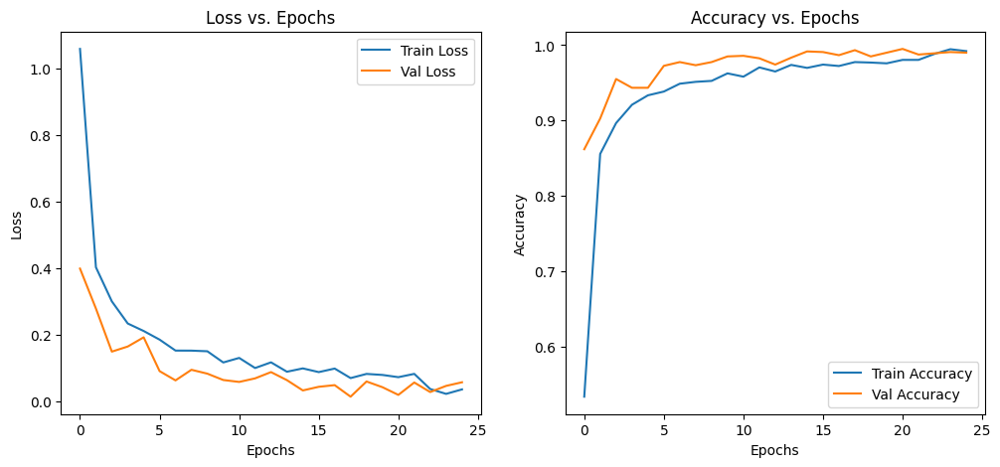
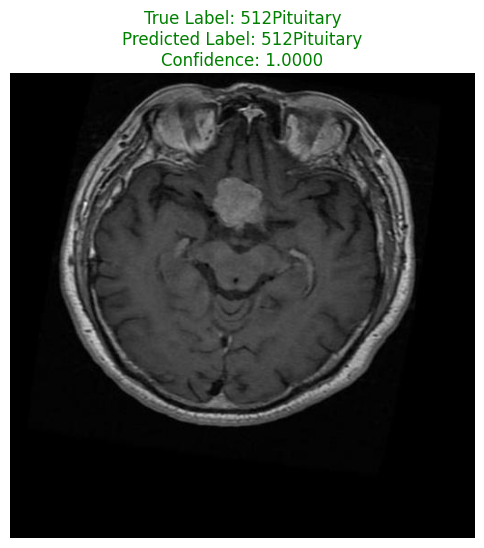
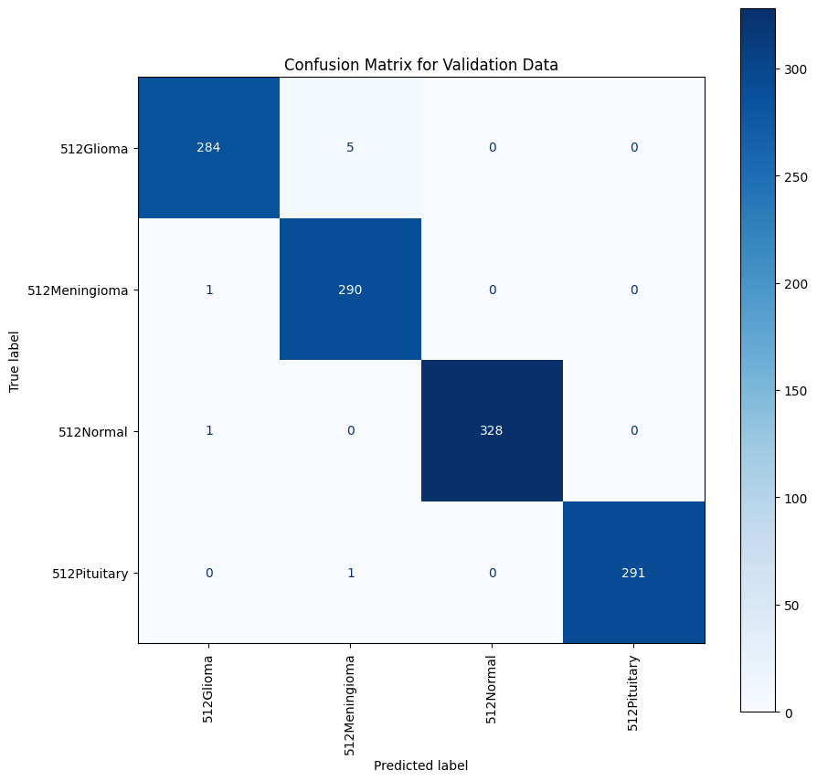

<div align="center">

# 🧠 Brain Tumor Classification using PyTorch & Modern CNNs

<p>A deep learning project for the multi-class classification of brain tumors from MRI scans, leveraging the power of PyTorch, timm, and state-of-the-art Convolutional Neural Networks.</p>

<p>
  <a href="#-project-overview"><strong>Overview</strong></a> ·
  <a href="#-key-features"><strong>Features</strong></a> ·
  <a href="#-results-and-performance"><strong>Results</strong></a> ·
  <a href="#-how-to-use"><strong>Usage</strong></a> ·
  <a href="#-technologies-used"><strong>Tech Stack</strong></a>
</p>


</div>

---

## 📖 Project Overview

This project presents a deep learning solution for the automated classification of brain tumors from MRI scans. The model is trained to accurately distinguish between four categories: *glioma, **meningioma, **pituitary tumor, and **no tumor*. By leveraging modern Convolutional Neural Network (CNN) architectures and advanced data augmentation techniques, this project aims to provide a reliable tool to assist in medical diagnosis.

The transition from a fast.ai implementation to a pure PyTorch and timm framework allows for greater flexibility, more granular control over the training process, and access to a wider range of state-of-the-art pretrained models.

---

## ✨ Key Features

* *High Accuracy:* Achieves high classification accuracy using a powerful ConvNeXt model.
* *Modern Architecture:* Utilizes the timm library to implement ConvNeXt, a state-of-the-art vision model.
* *Advanced Augmentation:* Employs the albumentations library for a robust set of image augmentations, making the model resilient to variations in MRI scans.
* *End-to-End Pipeline:* Provides a complete pipeline from data loading and preprocessing to training, validation, and visualization.
* *Clear Visualizations:* Generates easy-to-understand plots for training history, individual predictions, and a confusion matrix for performance evaluation.

---

## 📊 Results and Performance

The model was trained for 25 epochs, demonstrating excellent learning and generalization capabilities. The training and validation loss and accuracy curves are shown below.



### Sample Prediction

Here is an example of the model making a correct prediction on a randomly selected image from the validation set.



### Confusion Matrix

The confusion matrix provides a detailed breakdown of the model's performance across all four classes in the validation set. The diagonal elements show the number of correct predictions for each class.


``

---

## 🚀 How to Use

To get this project up and running on your own machine, follow these steps.

*1. Clone the repository:*
```bash
git clone [https://github.com/Mazen-Yasser/Automated-Brain-Tumor-Classification-via-Deep-Learning.git](https://github.com/Mazen-Yasser/Automated-Brain-Tumor-Classification-via-Deep-Learning.git)
cd Automated-Brain-Tumor-Classification-via-Deep-Learning
